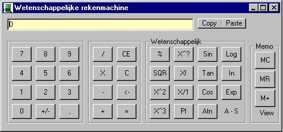



## Calculator \(Advanced\)

### Description

This is a basic scientific calculator

Supporting all major functions!

Nice example for beginning programmers!

Don't forget to rate it :)
 
### More Info
 
If you use this code in one one of your projects please give me some credit, that's all i'm asking

             |
---                |---
**Submitted On**   |2000-03-20 22:50:58
**By**             |[Wauters Arne](https://github.com/Planet-Source-Code/PSCIndex/blob/master/ByAuthor/wauters-arne.md)
**Level**          |Beginner
**User Rating**    |4.3 (30 globes from 7 users)
**Compatibility**  |VB 5\.0, VB 6\.0
**Category**       |[Math/ Dates](https://github.com/Planet-Source-Code/PSCIndex/blob/master/ByCategory/math-dates__1-37.md)
**World**          |[Visual Basic](https://github.com/Planet-Source-Code/PSCIndex/blob/master/ByWorld/visual-basic.md)
**Archive File**   |[CODE\_UPLOAD40993202000\.zip](https://github.com/Planet-Source-Code/wauters-arne-calculator-advanced__1-6715/archive/master.zip)

